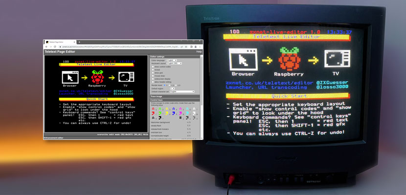
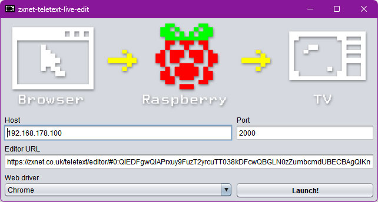

# ZXnet Teletext Editor Live Preview

Enjoy a live preview of your Teletext screens while editing!

Required:

* Java 11 runtime (e.g. [AdoptOpenJDK](https://adoptopenjdk.net/))
* A Raspberry Pi running raspi-teletext (see below)

To run:

* `java -jar zxnet-teletext-live-edit-1.0-jar-with-dependencies.jar`
* Enter Raspberry Pi IP address and network port
* Choose your browser
* Launch!

Alternatively, you can clone this project and start `Main` in your IDE, or build
everything yourself using Maven.

## Raspberry Pi setup

* Obtain 4-pin A/V cable
* Configure Raspberry to use [analog video output](https://mlagerberg.gitbooks.io/raspberry-pi/content/3.5-analog-video-output.html)
* Connect Raspberry composite video output to TV
* Download [raspi-teletext](https://github.com/ali1234/raspi-teletext)
* Run `make`
* `sudo tvctl on`
* Enable network connections:
* `nc -l 2000 | teletext -`

To handle reconnects, use a little script to restart the netcat server in a loop. For example:

    $ cat > LOOP_LISTEN
    #!/bin/bash
    while true
    do
      echo "Listen on port 2000..."
      nc -l 2000 | /home/pi/raspi-teletext/teletext -
    done

Then run `. LOOP_LISTEN` once.
